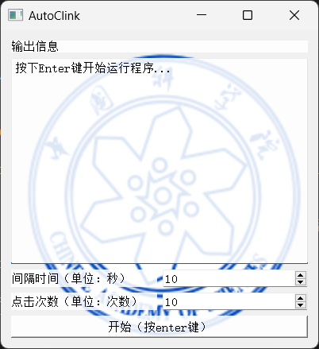

# AutoClicker

## 使用方法

当焦点在软件上时，键盘输入enter（或者点击“开始”按钮），即可开始自动点击鼠标所在位置。  
点击次数和点击间隔时间可自行设定 

软件在app中文件夹中，点击AutoClicker.exe即用，使用时不能更改app文件夹内文件位置

如果enter键无效，请点击键盘上另一个enter键

## 软件编写的背景

师兄在做实验需要拍图片，需要拍几百张图片，每隔15秒点击一次相同位置，自动化程度比较低，花半天写个软件应急。 

## 已解决bug

1.关闭界面后仍在点击

已经添加守护进程

2.按多次enter键后，开启多个点击

添加信号，运行点击后不能再次运行点击

## 其他

如有发现bug，请再github中的issues中提出，有时间我会尽力维护